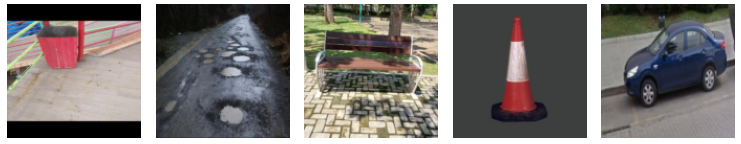
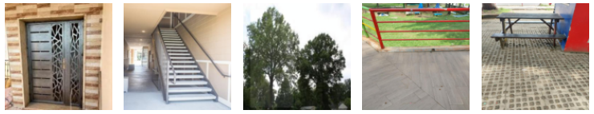
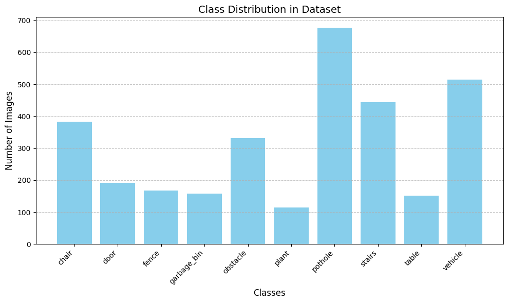
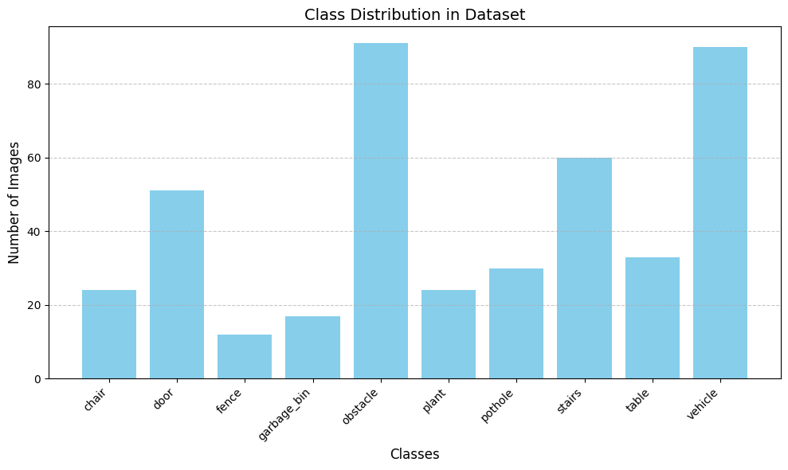

# Obstacles Detection and Alert System for Visually Impaired  

### Using Deep Learning and Node-RED  

## Overview  
This project introduces a robust solution to assist visually impaired individuals in navigating their environment using an obstacle detection and alert system. The system combines:  
- **Deep Learning Models**: A Convolutional Neural Network (CNN) trained from scratch and fine-tuned MobileNetV2 for obstacle classification.  
- **Alert System**: Real-time audio feedback using Node-RED, integrated with a Flask API to process predictions.  

## Features  
- Custom-trained deep learning models for obstacle classification.  
- Real-time alerts through audio guidance for identified obstacles.  
- Flask API for model prediction and integration with Node-RED for automation.  

## Dataset Description

The dataset is a **custom-built collection** created by merging several publicly available datasets and scraping additional images of common obstacles to ensure comprehensive coverage of real-world scenarios. It includes **10 distinct classes**, each representing a type of obstacle frequently encountered by visually impaired individuals. 

Those some image from the dataset : 



#### Classes:
1. **Chair**
2. **Door**
3. **Fence**
4. **Garbage Bin**
5. **Obstacle** (e.g., pole, traffic cone, fire hydrant)
6. **Plant**
7. **Pothole**
8. **Stairs**
9. **Table**
10. **Vehicle**

Class Distribution in Training set : 


Class Distribution in Testing set : 



This is the obstacles dataset used in the project : [Dataset Link](https://www.kaggle.com/datasets/idrisskh/obstacles-dataset/)

---

## Getting Started  

### Prerequisites  
Ensure you have the following installed on your system:  
- Python 3.8+ with pip (Python package manager)  
- NPM (package manager) 
- Node.js and Node-RED  
- Flask  

---

## Running the System  

### Clone the Repository  
   ```bash  
   git clone https://github.com/drisskhattabi6/Obstacle-Detection-with-Alert-System-for-Visually-Impaired.git  
   cd Obstacle-Detection-with-Alert-System-for-Visually-Impaired 
   ```  

### 1. Running the Flask API  
The Flask API serves as the backend for processing images and returning obstacle classifications.  

**Steps:**  
1. Navigate to the `api` directory:  
   ```bash  
   cd api  
   ```  
2. Start the Flask server:  
   ```bash  
   python main.py  
   ```  
3. The API will start running at `http://127.0.0.1:5000`.  

---

### 2. Setting Up and Running Node-RED  
The Node-RED flow is responsible for integrating the API predictions with the alert system.  

**Steps:**  
1. Install Node-RED globally if you haven’t already:  
   ```bash  
   npm install -g node-red  
   ```  
2. Launch Node-RED:  
   ```bash  
   node-red  
   ```  
3. Open the Node-RED interface at `http://127.0.0.1:1880`.  
3. Open the Node-RED dashboard at `http://127.0.0.1:1880/ui`.  
4. Import the provided Node-RED flow file (`Node-Red-flows.json`) into Node-RED.  
   - Click on the menu (top-right corner) → "Import" → "Clipboard".  
   - Paste the content of `Node-Red-flows.json` and deploy the flow.  
5. Ensure that the Node-RED flow triggers the Flask API and processes responses for the audio alerts.  

**⚠️ Warning:** you will need to download some flows from pallet manager in Node-Red

---

### 3. Running the Alert System  
The alert system triggers audio notifications based on the API's predictions.  

1. Verify the Flask API and Node-RED are running.  
2. Test the system by uploading an obstacle image through the Node-RED dashboard or directly via the API.  
3. Ensure the audio feedback plays automatically for detected obstacles.  

---

## Project Structure  
```plaintext  
obstacle-detection-alert-system/  
├── imgs/  
├── Obstacles Imgs Example/  
├── api/  
│   ├── main.py            # Flask API for predictions 
│   ├── Fine-Tuned MobileNetV2 model
├── obstacles detecting for video using Python/  
│   ├── predict_video.py     
│   ├── vid1.mp4
│   ├── vid2.mp4
│   ├── vid3.mp4
├── Node-Red-flows.json    # Node-RED flow configuration 
├── Research Paper.pdf     # Research Paper
└── README.md              # Project documentation 
```  

---

## References  
1. Mark Sandler Andrew Howard Menglong Zhu Andrey Zhmoginov Liang-Chieh Chen. MobileNetV2: Inverted Residuals and Linear Bottlenecks. Google Inc
2. Yahia Said, Mohamed Atri, Marwan Ali Albahar, Ahmed Ben Atitallah and Yazan Ahmad Alsariera: Obstacle Detection System for Navigation Assistance of Visually Impaired People Based on Deep Learning Techniques
3. O’Shea, Keiron, and Ryan Nash. An Introduction to Convolutional Neural Networks. arXiv preprint arXiv:1511.08458, 2015.
4. Simonyan, Karen, and Andrew Zisserman. Very Deep Convolutional Networks for Large-Scale Image Recognition. arXiv preprint arXiv:1409.1556, 2014.
5. What is MobileNetV2?, Analytics Vidhya  https://www.analyticsvidhya.com/blog/2023/12/what-is-mobilenetv2 
6. Node-RED Documentation. https://nodered.org/docs/ 
7. Albawi, Saad, et al. Understanding of a Convolutional Neural Network. Proceedings of 2017 International Conference on Engineering and Technology (ICET), IEEE, 2017.
8. Deng, Jia, et al. ImageNet: A Large-Scale Hierarchical Image Database. Proceedings of the 2009 IEEE Conference on Computer Vision and Pattern Recognition (CVPR), IEEE, 2009.
9. Shorten, Connor, and Taghi M. Khoshgoftaar. A Survey on Image Data Augmentation for Deep Learning. Journal of Big Data, 6(1), 2019. 

---

## Realized by: 
- **Khattabi Idriss**
- **Boufarhi Ayman**

Under the supervision of **Mr. Faouzi TAYALATI**

This was a *Deep Learning and Transfer Learning* Module Project - Master of AI and Data Sceince 

FST Tanger - Morocco