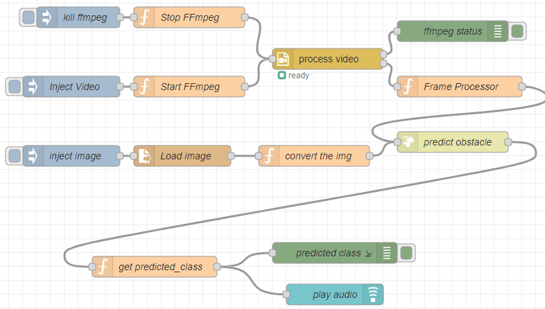
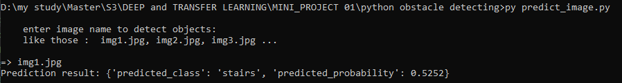
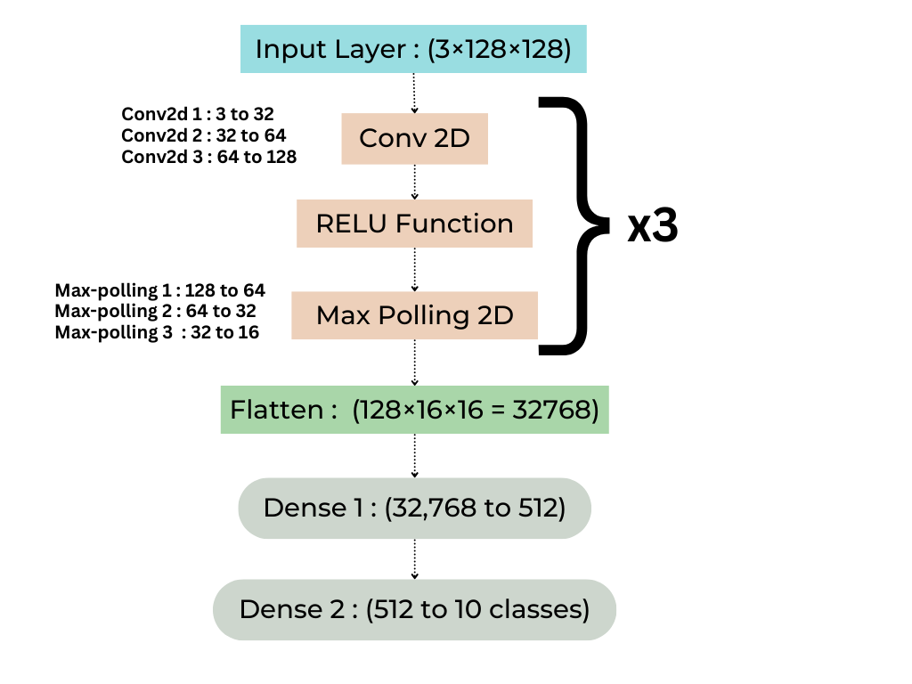
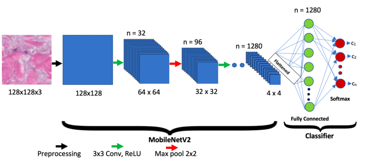

# Obstacles Detection and Alert System for Visually Impaired  

### Using Deep Learning and Node-RED  

## Overview  

This project introduces a robust solution to assist visually impaired individuals in navigating their environment using an obstacle detection and alert system. The system combines:  

- **Deep Learning Models**: A Convolutional Neural Network (CNN) trained from scratch and fine-tuned MobileNetV2 for obstacle classification.
- **Alert System**: Real-time audio feedback using Node-RED, integrated with a Flask API to process predictions.  

**Read The Scientific Paper to know more.**

## Features  

- Custom-trained deep learning models for obstacle classification.  
- Real-time alerts through audio guidance for identified obstacles.  
- Flask API for model prediction and integration with Node-RED for automation.  

## Dataset Description

The dataset is a **custom-built collection** created by merging several publicly available datasets and scraping additional images of common obstacles to ensure comprehensive coverage of real-world scenarios. It includes **10 distinct classes**, each representing a type of obstacle frequently encountered by visually impaired individuals. 

Those some image from the dataset : 


#### Classes:

1. **Chair**
2. **Door**
3. **Fence**
4. **Garbage Bin**
5. **Obstacle** (e.g., pole, traffic cone, fire hydrant)
6. **Plant**
7. **Pothole**
8. **Stairs**
9. **Table**
10. **Vehicle**

Class Distribution in Training set : 


Class Distribution in Testing set : 


This is the obstacles dataset used in the project : [Dataset Link](https://www.kaggle.com/datasets/idrisskh/obstacles-dataset/)

---

### Prerequisites to Getting Started 

Ensure you have the following installed on your system:  
- Python 3.8+ with pip (Python package manager)
- NPM (package manager)
- Node.js and Node-RED 
- Python Libraries : Flask, OpenCV, requests, torch, torchvision, pillow

---

## Running the System  

### Clone the Repository  
   ```bash  
   git clone https://github.com/drisskhattabi6/Obstacle-Detection-with-Alert-System-for-Visually-Impaired.git  
   cd Obstacle-Detection-with-Alert-System-for-Visually-Impaired 
   ```  

### 1. Running the Flask API  
The Flask API serves as the backend for processing images and returning obstacle classifications.  

**Steps:**  
1. Navigate to the `api` directory:  
   ```bash  
   cd api  
   ```  
2. Start the Flask server:  
   ```bash  
   python main.py  
   ```  
3. The API will start running at `http://127.0.0.1:5000`.  

---

## 2. Setting Up and Running Node-RED

The Node-RED flow is responsible for integrating the API predictions with the alert system.

### **Steps:**

1. **Install Node-RED globally** if you haven’t already:

   ```bash
   npm install -g node-red
   ```

2. **Launch Node-RED**:
   Run Node-red in 'python obstacle detecting' Folder to be able to use videos and images
   ```bash
   node-red
   ```

---

### **Download FFmpeg**

FFmpeg is required for processing video and extracting frames. Follow these steps to install FFmpeg on Windows:
Let's install FFmpeg:

1. **Windows:**
   - Download FFmpeg from https://www.gyan.dev/ffmpeg/builds/
   - Get the "ffmpeg-git-full.7z" version
   - Extract it
   - Add the `bin` folder to your System PATH:
     1. Open System Properties → Advanced → Environment Variables
     2. Under System Variables, find "Path"
     3. Click Edit → New
     4. Add the full path to FFmpeg's bin folder (e.g., `C:\ffmpeg\bin`)

2. **Linux:**
   ```bash
   sudo apt update
   sudo apt install ffmpeg
   ```

3. **Mac:**
   ```bash
   brew install ffmpeg
   ```

After installation:
1. Restart your computer (to ensure PATH changes take effect)
2. Restart Node-RED

To verify FFmpeg is installed correctly, open a terminal/command prompt and type:
   ```bash
   ffmpeg -version
   ```
---

### 3. Install Node-RED Nodes

You may need to install additional nodes for video processing and object detection. Follow these steps to install the required nodes:

1. In the Node-RED editor, click on the **Menu** (top-right corner) and select **Manage palette**.
2. Go to the **Install** tab and search for the following nodes, then click **Install**:

   - **node-red-node-ffmpeg**: Provides FFmpeg functionality.
   - **node-red-contrib-ffmpeg**: Includes FFmpeg-related nodes for video and image handling.
   - **node-red-node-ui_audio**: For audio output if required.

---

### 4. Import the Flow

1. In the Node-RED editor, click the **Menu** (top-right corner), then select **Import**.
2. Paste the flow JSON provided and click **Import** to add the flow to your workspace.

---

### 5. Configure FFmpeg Path in Node-RED

Ensure that FFmpeg is correctly configured in your Node-RED flow:

1. If the **ffmpeg** node asks for the FFmpeg path, provide the path where FFmpeg is installed. For example, `C:\ffmpeg\bin\ffmpeg.exe`.

---

### 6. Test the Flow

1. Once everything is set up, click the **Deploy** button to deploy your flow.
2. Use the **inject node** to input a video or image for processing.
3. Check the **Debug** tab to view the object detection results and any other outputs.

---

### 7. Open the Node-RED Interface

- Navigate to `http://127.0.0.1:1880` to access the Node-RED editor.
- Open the Node-RED dashboard at `http://127.0.0.1:1880/ui`.

---

### 8. Import the Flow File

1. Import the provided Node-RED flow file (`Node-Red-flows.json`):
   - Click on the **Menu** (top-right corner) → **Import**.
   - choose the json file `Node-Red-flows.json` and click **Deploy**.


This is What will appear to you :



---

### 9. Ensure Flask API and Alerts Integration

Ensure that the Node-RED flow triggers the **Flask API** and processes responses for the **audio alerts**.

---

**Warning :** 

- Run Node-red in 'python obstacle detecting' Folder to be able to use videos and images, 
- if you want to change the image to predict, go to inject image node, double click, change the path of the image
- if you want to change the video to predict, go to Start FFmpeg node, double click, chnage the path of the video : "'-i', 'vid1.mp4'"
- To run the audio while predicting, the Node-RED dashboard (`http://127.0.0.1:1880/ui`) must be opened, and Item like button must be added to open the dashboard

---

### This is the content of the flow : 

1. **Inject Image**: The flow begins with an image being injected (`inject image`), which will load an image (`imgs/img1.jpg`) and pass it to the `Load image` node.

2. **Load Image**: This node reads the image file, sending it as a payload to the next function.

3. **Convert the Image**: The `convert the img` function prepares the image by converting it into a `multipart/form-data` format suitable for making an HTTP POST request.

4. **Predict Obstacle**: The image is sent to an HTTP request node (`predict obstacle`) for processing at the endpoint `http://localhost:5000/predict`. The result will be passed to the next function.

5. **Process Prediction**: The result from the prediction (`predicted_class` and `predicted_probability`) is processed to display an appropriate message (e.g., “A 'car' has been detected!!” if the probability is above 0.8, otherwise “probability is low the 0.8”).

6. **Audio Output**: If a prediction is made, an audio message (`play audio`) is triggered to read out the detected class.

7. **FFmpeg Video Processing**: The flow includes the `process video` and `Frame Processor` nodes, which handle video frames. The `Start FFmpeg` node triggers FFmpeg to start processing video (`vid1.mp4`), converting frames to images, which are then analyzed for objects.

8. **Debug Nodes**: There are several debug nodes in the flow that allow you to view the output in the sidebar (`predicted class`, `ffmpeg status`), which help with troubleshooting.

9. **Stop FFmpeg**: If needed, the `Stop FFmpeg` node can be triggered to stop FFmpeg from processing the video.

This flow is designed to handle both image and video input, process them with FFmpeg, make predictions via an HTTP request, and output the result as both text and audio.

### Troubleshooting

- **FFmpeg Issues**: If FFmpeg isn't processing frames correctly, verify that FFmpeg is installed and added to your system’s PATH. You can test FFmpeg by running `ffmpeg -version` in Command Prompt.
  
- **Missing Nodes**: If any nodes are missing, you can install them using the Palette Manager in the Node-RED editor.

- **Audio Output Issues**: Ensure the **ui_audio** node is correctly configured for your audio setup and that your system has audio output enabled.

---

## Project Structure  

```plaintext  
obstacle-detection-alert-system/  
├── imgs/  
├── Obstacles Imgs Example/  
├── api/  
│   ├── main.py                 # Flask API for predictions 
│   ├── Fine-Tuned MobileNetV2 model
├── python obstacle detecting/  # you can test the model on videos or images using Python
│   ├── predict_video.py        # script to use the model in video prediction 
│   ├── predict_image.py        # script to use the model in image prediction 
│   ├── imgs/                   # use those imgs for prediction
│   ├── vid1.mp4
│   ├── vid2.mp4
│   ├── vid3.mp4
├── Node-Red-flows.json         # Node-RED flow configuration 
├── Research Paper.pdf          # Research Paper
└── README.md                   # Project documentation 
```  

## More Informations:

- In 'Python obstacles detecting' Folder you can test the model on videos or images, just run the python code, and make sure that the API is running

For image: 


For Video: 


- Notebooks Folder, Contains How I train the CNN from Scratch, and How I Fine-tune MobileNetV2 :

CNN Architucture: 


MobileNetV2 Architucture: 


- To run the audio while predicting, the Node-RED dashboard (`http://127.0.0.1:1880/ui`) must be opened, and Item like button must be added to open the dashboard

---

## References :

1. Mark Sandler Andrew Howard Menglong Zhu Andrey Zhmoginov Liang-Chieh Chen. MobileNetV2: Inverted Residuals and Linear Bottlenecks. Google Inc
2. Yahia Said, Mohamed Atri, Marwan Ali Albahar, Ahmed Ben Atitallah and Yazan Ahmad Alsariera: Obstacle Detection System for Navigation Assistance of Visually Impaired People Based on Deep Learning Techniques
3. O’Shea, Keiron, and Ryan Nash. An Introduction to Convolutional Neural Networks. arXiv preprint arXiv:1511.08458, 2015.
4. Simonyan, Karen, and Andrew Zisserman. Very Deep Convolutional Networks for Large-Scale Image Recognition. arXiv preprint arXiv:1409.1556, 2014.
5. What is MobileNetV2?, Analytics Vidhya  https://www.analyticsvidhya.com/blog/2023/12/what-is-mobilenetv2 
6. Node-RED Documentation. https://nodered.org/docs/ 
7. Albawi, Saad, et al. Understanding of a Convolutional Neural Network. Proceedings of 2017 International Conference on Engineering and Technology (ICET), IEEE, 2017.
8. Deng, Jia, et al. ImageNet: A Large-Scale Hierarchical Image Database. Proceedings of the 2009 IEEE Conference on Computer Vision and Pattern Recognition (CVPR), IEEE, 2009.
9. Shorten, Connor, and Taghi M. Khoshgoftaar. A Survey on Image Data Augmentation for Deep Learning. Journal of Big Data, 6(1), 2019. 

---

## Realized by: 

- **Khattabi Idriss**
- **Boufarhi Ayman**

Under the supervision of **Mr. Faouzi TAYALATI**

This was a **Deep Learning and Transfer Learning** Module Project - Master of AI and Data Sceince.

FST Tanger - Morocco